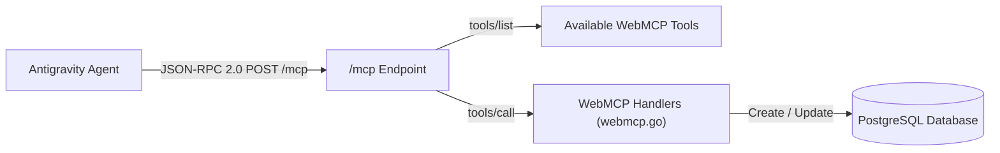

# Create & Manage Journeys via WebMCP

This skill defines the mandatory workflow for Antigravity agents to create, update, inspect, and test Journey Engine workflow drafts using the **WebMCP standard interface** (`document.modelContext` / `POST /mcp`).

> [!IMPORTANT]
> **Mandatory Rule**: Whenever the user asks to create, modify, or save a journey workflow, you **MUST** use the WebMCP `create_journey_draft` tool via the `/mcp` JSON-RPC 2.0 endpoint (or `document.modelContext` in-browser), rather than modifying database tables or bypassing the WebMCP protocol layer.

---

## WebMCP Architecture Overview



- **WebMCP Endpoint**: `http://localhost:3002/mcp` (proxied to `control-api` on port `8080`).
- **Protocol**: JSON-RPC 2.0 (`tools/list` and `tools/call`).
- **Bridge Script**: Serves from `http://localhost:3002/.webmcp/bridge.js`.

---

## Step-by-Step Execution Workflow

### 1. Verify Platform Readiness
Check WebMCP platform readiness by calling the `get_system_health` WebMCP tool:

```bash
curl -s -X POST http://localhost:3002/mcp \
  -H "Content-Type: application/json" \
  -d '{
    "jsonrpc": "2.0",
    "id": 1,
    "method": "tools/call",
    "params": {
      "name": "get_system_health",
      "arguments": {}
    }
  }'
```

---

### 2. Construct Journey Node Graph
Ensure the journey definition includes standard node kinds and connecting edges:

- **Start Node** (`trigger`): `{"id": "node-start", "name": "Start Event", "type": "trigger", "position": {"x": 100, "y": 100}}`
- **Action Nodes** (`Email`, `SMS`, `Delay`, `Condition`, `Experiment`):
  - **Email**: `{"id": "node-email", "name": "Email Action", "type": "Email", "config": {"template_id": "tpl-1", "subject": "Welcome!"}, "position": {"x": 100, "y": 300}}`
  - **Condition**: `{"id": "node-cond", "name": "Check VIP", "type": "Condition", "config": {"condition_expression": "tier == 'gold'"}, "position": {"x": 100, "y": 300}}`
- **Exit Node** (`Exit`): `{"id": "node-exit", "name": "Exit Flow", "type": "Exit", "position": {"x": 100, "y": 500}}`

- **Connecting Edges**:
  - Linear edge: `{"id": "edge-1", "source": "node-start", "target": "node-email", "condition": "source"}`
  - Branch edge: `{"id": "edge-cond-true", "source": "node-cond", "target": "node-email", "condition": "true"}`

---

### 3. Create & Save Journey Draft via WebMCP `create_journey_draft`
Invoke the `create_journey_draft` tool over the WebMCP `/mcp` interface:

```bash
curl -s -X POST http://localhost:3002/mcp \
  -H "Content-Type: application/json" \
  -d '{
    "jsonrpc": "2.0",
    "id": 2,
    "method": "tools/call",
    "params": {
      "name": "create_journey_draft",
      "arguments": {
        "name": "<Journey Name>",
        "description": "<Description>",
        "nodes": [...],
        "edges": [...]
      }
    }
  }'
```

---

### 4. Verify Saved Draft Details
Retrieve the saved draft via WebMCP `get_journey_draft` tool:

```bash
curl -s -X POST http://localhost:3002/mcp \
  -H "Content-Type: application/json" \
  -d '{
    "jsonrpc": "2.0",
    "id": 3,
    "method": "tools/call",
    "params": {
      "name": "get_journey_draft",
      "arguments": {
        "draft_id": "<draft_id>"
      }
    }
  }'
```

---

### 5. Trigger Test Execution via WebMCP `trigger_test_run`
Optionally run a test execution for the new draft against a static audience list or mock payload:

```bash
curl -s -X POST http://localhost:3002/mcp \
  -H "Content-Type: application/json" \
  -d '{
    "jsonrpc": "2.0",
    "id": 4,
    "method": "tools/call",
    "params": {
      "name": "trigger_test_run",
      "arguments": {
        "draft_id": "<draft_id>",
        "static_list_id": "list-static-001"
      }
    }
  }'
```

---

## Verification & Acceptance Checklist

- [ ] WebMCP `get_system_health` returns `status: healthy` and `webmcp: enabled`.
- [ ] `create_journey_draft` returns HTTP 200 with valid `draft_id` and version number.
- [ ] Saved nodes and edges construct a valid, connected DAG graph ending in an `Exit` node.
