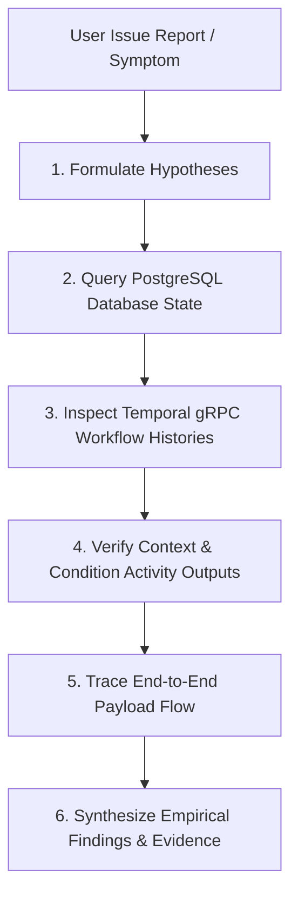

# System Issue Investigation & Empirical Verification Skill

Use this skill when investigating bugs, workflow branch routing mismatches, condition evaluation discrepancies, or data flow anomalies across the event-driven journey engine stack.

> [!IMPORTANT]
> **Core Objective**: Formulate empirical hypotheses and verify them using live APIs, database queries, and Temporal gRPC history inspection **WITHOUT changing existing production code** until requested.

---

## Workflow Steps



---

## 1. Formulate Diagnostic Hypotheses
Before editing code or jumping to conclusions, enumerate potential root causes across layers:
- **UI / API Payload Layer**: Was `static_list_id` or proper input context included in the HTTP request payload, or did it fall back to default mock inputs?
- **Database Layer**: Do the target static list rows, journey draft nodes, or test run records in PostgreSQL contain the expected JSON attributes?
- **Temporal Workflow Layer**: Did Temporal launch 1 workflow per row, or single fallback workflows? Was `EvaluateCondition` passed the flattened context?
- **Branch Evaluation Layer**: Did `EvaluateCondition` evaluate to `true` or `false`, and did the engine route to the correct `sourceHandle` branch (`true` vs `false`)?

---

## 2. Query Live Database State (PostgreSQL & Control API)
Inspect active draft nodes, edges, static list audience items, and test run records in PostgreSQL.

### A. Query REST API Endpoints
```bash
# Check journey drafts and node configurations
curl -s http://localhost:8080/api/v1/journeys/drafts

# Check uploaded static lists
curl -s http://localhost:8080/api/v1/static-lists

# Check test runs
curl -s http://localhost:8080/api/v1/journeys/runs
```

### B. Query PostgreSQL Directly via Docker
```bash
# Inspect static lists items & attributes
docker compose exec -T postgres psql -U journey -d journeydb -c "SELECT list_id, name, item_count, items FROM static_lists;"

# Inspect test run records
docker compose exec -T postgres psql -U journey -d journeydb -c "SELECT test_run_id, draft_id, status, mock_inputs FROM test_runs ORDER BY created_at DESC LIMIT 5;"
```

---

## 3. Inspect Temporal gRPC Workflow Event Histories
Use a temporary research script with the Temporal Go SDK client (`c.GetWorkflowHistory`) to extract un-truncated, exact history events for target workflow IDs.

### Temporal History Inspection Pattern
Create a scratch script in `<artifacts_dir>/scratch/inspect_workflows.go` or `test/inspect_workflows.go`:

```go
package main

import (
	"context"
	"fmt"
	"log"

	enumspb "go.temporal.io/api/enums/v1"
	"go.temporal.io/api/workflowservice/v1"
	"go.temporal.io/sdk/client"
)

func main() {
	ctx := context.Background()

	c, err := client.Dial(client.Options{
		HostPort:  "127.0.0.1:7233",
		Namespace: "default",
	})
	if err != nil {
		log.Fatalf("Failed to connect Temporal SDK client: %v", err)
	}
	defer c.Close()

	resp, err := c.ListWorkflow(ctx, &workflowservice.ListWorkflowExecutionsRequest{
		Namespace: "default",
	})
	if err != nil {
		log.Fatalf("Failed to list workflows: %v", err)
	}

	for idx, wf := range resp.Executions {
		fmt.Printf("\n=== [%d] Workflow ID: %s | Run ID: %s ===\n", idx+1, wf.Execution.WorkflowId, wf.Execution.RunId)
		iter := c.GetWorkflowHistory(ctx, wf.Execution.WorkflowId, wf.Execution.RunId, false, enumspb.HISTORY_EVENT_FILTER_TYPE_ALL_EVENT)

		for iter.HasNext() {
			event, err := iter.Next()
			if err != nil {
				break
			}
			switch event.GetEventType() {
			case enumspb.EVENT_TYPE_WORKFLOW_EXECUTION_STARTED:
				attr := event.GetWorkflowExecutionStartedEventAttributes()
				if attr.Input != nil && len(attr.Input.Payloads) > 0 {
					fmt.Printf("  - WORKFLOW_STARTED Input: %s\n", string(attr.Input.Payloads[0].Data))
				}

			case enumspb.EVENT_TYPE_ACTIVITY_TASK_SCHEDULED:
				attr := event.GetActivityTaskScheduledEventAttributes()
				actName := attr.GetActivityType().GetName()
				if actName == "EvaluateCondition" || actName == "ExecuteActionGateway" {
					inputData := ""
					if attr.Input != nil && len(attr.Input.Payloads) > 0 {
						inputData = string(attr.Input.Payloads[0].Data)
					}
					fmt.Printf("  - SCHEDULED [%s]: %s\n", actName, inputData)
				}

			case enumspb.EVENT_TYPE_ACTIVITY_TASK_COMPLETED:
				attr := event.GetActivityTaskCompletedEventAttributes()
				if attr.Result != nil && len(attr.Result.Payloads) > 0 {
					res := string(attr.Result.Payloads[0].Data)
					if res == "true" || res == "false" || len(res) > 20 {
						fmt.Printf("  - COMPLETED Result: %s\n", res)
					}
				}
			}
		}
	}
}
```

Execute the research script:
```bash
go run ./test/inspect_workflows.go
```

---

## 4. Cross-Layer Verification Checklist

- [ ] **Payload Integrity**: Does the `WORKFLOW_STARTED` input contain the audience member attributes (`tier`, `score`, `region`) or only generic testpack metadata?
- [ ] **Context Flattening**: Does `EvaluateCondition` receive flattened top-level keys (`"tier": "gold"`) alongside nested objects?
- [ ] **Condition Activity Result**: Did `EvaluateCondition` return `true` or `false`?
- [ ] **Node Visit & Action Gateway**: Did `true` route to the node on handle `true` (e.g. Email), and `false` route to the node on handle `false` (e.g. SMS)?
- [ ] **Run Identity Matching**: Are the workflow IDs being compared from the **same test run ID** (e.g. `tr-369711-row-1` vs `tr-369711-row-2`), rather than comparing an older run against a newer run?

---

## 5. Synthesize Findings

Present findings in a structured report detailing:
1. **Empirical Evidence**: Raw event payloads from `WORKFLOW_STARTED`, `EvaluateCondition`, and `ExecuteActionGateway`.
2. **Confirmed Root Cause**: Precise explanation of why the observed behavior occurred.
3. **Hypothesis Verification**: Confirmation of which hypothesis was proven by the empirical data.
4. **Actionable Recommendations**: Next steps or suggested fixes (without making unrequested code changes).
