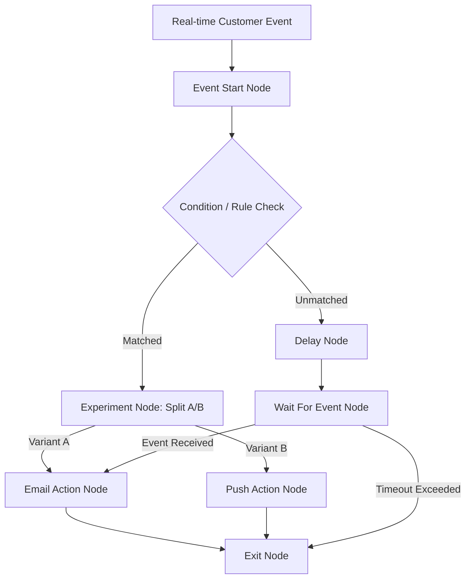

# User Guide: Event-Driven Customer Journey Engine

Welcome to the **User Guide** for the Event-Driven Customer Journey Engine. This documentation provides a comprehensive guide for marketers, product managers, developers, and operations teams to design, configure, test, monitor, and manage automated multi-channel customer journeys.

---

## System Overview & Key Concepts

The Event-Driven Customer Journey Engine is an enterprise customer engagement platform powered by high-throughput event processing and deterministic workflow execution. It enables teams to create automated, multi-step customer journeys triggered by real-time behavioral events (such as user registrations, cart abandonments, or purchase completions).

### Key Architectural Concepts

1. **Journeys & Drafts**:
   - A **Journey** represents an automated multi-step communication and decision workflow.
   - Journeys exist in **Draft** state while under design and become **Active** once published.

2. **Visual Graph & Canvas Nodes**:
   - Workflows are constructed visually on a drag-and-drop canvas using nodes connected by edges.
   - All standard canvas nodes adhere to standardized dimensions (**346px width × 112px height**) for consistent layout alignment and visual clarity.

3. **Canonical Intermediate Representation (IR)**:
   - When a draft is published, the engine compiles the visual graph into an immutable **Canonical IR** graph schema.
   - Every revision produces a versioned hash checksum to guarantee execution determinism.

4. **Workflow Execution Runs & Test Lanes**:
   - Published journeys execute as distributed, stateful workflows.
   - **Production Runs** process live customer event streams.
   - **Test Runs** process synthetic or static audience lists for pre-launch validation.

5. **Catalogs & Static Audience Lists**:
   - **Catalogs** store reusable event schemas, action templates (Email, SMS, Push, In-App, Webhook), global parameters, and conversion metrics.
   - **Static Audience Lists** store CSV customer cohorts for automated testing and batch segment validation.

---

## User Guide Navigation

This documentation suite is organized into three primary modules:

| Document | Description |
| :--- | :--- |
| [**README.md**](./README.md) | System overview, core concepts, workflow lifecycle, and quick start guide *(this file)*. |
| [**pages.md**](./pages.md) | Detailed, step-by-step documentation of all 7 application views, page controls, tables, and page-level actions. |
| [**components.md**](./components.md) | Comprehensive reference for all visual UI components, canvas node specifications, modals, inspector panels, and design tokens. |

---

## Quick Start Guide: Building Your First Journey

Follow these five steps to build, validate, test, and publish a new customer journey:

### Step 1: Create a New Journey Draft
1. Navigate to the **Journeys** page (`#journeys`) from the top navigation bar.
2. Click the **+ New Journey** button in the upper right.
3. In the **Create Journey Modal**, enter a descriptive **Journey Name**, an optional **Description**, and select the **Tenant ID**.
4. Click **Create Draft**. The app will automatically navigate to the visual **Canvas Editor**.

### Step 2: Assemble Nodes on the Canvas
1. Drag node components from the **Palette** on the left onto the workspace canvas:
   - **Event Start Node**: Select the trigger event (e.g., `user_signup`).
   - **Condition Node**: Add logic rules to branch based on customer attributes (e.g., `user.is_premium == true`).
   - **Experiment Node**: Add multi-variant splits to test message performance.
   - **Action Nodes**: Add communication channels (Email, Push, SMS, In-App, or Webhook).
   - **Exit Node**: Terminate the workflow.
2. Connect nodes by dragging wires between output handles and input handles.

### Step 3: Configure Node Properties
1. Click on any canvas node to open the **Node Inspector** on the right.
2. Set node parameters, template subject lines, delay durations, or variant split percentages.
3. Add custom key-value tokens using the **Parameter Modal**.

### Step 4: Validate and Test Run
1. Click **Validate Graph** on the Canvas Toolbar to ensure there are no disconnected handles or missing parameters.
2. Click **Auto Layout** to organize the graph neatly.
3. Click **Test Run** to trigger a test execution using a sample **Subject ID** or **Static Audience List**.
4. Verify execution step behavior in the **Run Detail** view (`#run-detail`).

### Step 5: Publish Version
1. Click **Publish** on the Canvas Toolbar.
2. The engine will compile the draft into a published version and generate a immutable IR revision checksum.
3. Track version history and diffs anytime on the **Version History** page (`#history`).

---

## Summary of Application Routes

| Route Hash | Page Name | Primary Function |
| :--- | :--- | :--- |
| `#journeys` | **Journeys Management** | View, search, filter, and create journey workflow drafts. |
| `#canvas` | **Journey Editor Canvas** | Visual drag-and-drop editor for designing and configuring workflows. |
| `#catalog` | **Catalog Directory** | Manage reusable event schemas, channel templates, attributes, and parameters. |
| `#runs` | **Run Execution List** | Monitor running, completed, paused, and failed workflow instances. |
| `#run-detail` | **Run Detail & Trace** | Visual execution graph trace, step logs, timeline, and signal simulation. |
| `#history` | **Version History** | Inspect revision history, hash checksums, and canonical IR diffs. |
| `#static-lists` | **Static Audience Lists** | Upload CSV target audience lists and inspect cohort attributes. |
