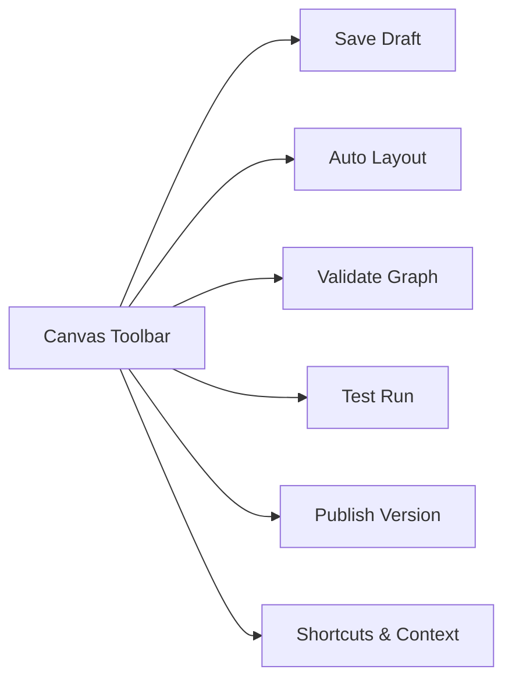

# User Guide: UI Components, Canvas Nodes & Modals Reference

This reference document provides comprehensive specifications for all user interface components, canvas nodes, inspector property panels, modals, toolbars, buttons, and design standards in the Event-Driven Customer Journey Engine.

---

## Table of Contents

1. [Canvas Node Dimensions & Design Contract](#1-canvas-node-dimensions--design-contract)
2. [Workflow Node Types & Configurations](#2-workflow-node-types--configurations)
3. [Inspector & Property Panels](#3-inspector--property-panels)
4. [Application Modals & Dialogs](#4-application-modals--dialogs)
5. [Canvas Toolbar & Viewport Controls](#5-canvas-toolbar--viewport-controls)
6. [Common & Global UI Components](#6-common--global-ui-components)

---

## 1. Canvas Node Dimensions & Design Contract

To ensure consistent alignment, visual balance, and clean auto-layout arrangement across the ReactFlow workspace, all standard workflow canvas nodes adhere to a strict dimensional contract:

| Property | Standard Value | Description |
| :--- | :--- | :--- |
| **Node Width** | `346px` | Fixed width across all node types. |
| **Node Height** | `112px` | Fixed height across all node types. |
| **Box Sizing** | `border-box` | Padding and borders are calculated within the fixed width/height boundaries. |
| **Border Radius** | `8px` (`rounded-lg`) | Consistent corner curvature across node containers. |
| **Background Color**| Dark Slate (`#171B26` / `#0F131D`) | Dark-theme container background with backdrop blur. |

---

## 2. Workflow Node Types & Configurations

Workflows are built by chaining together nodes connected via output handles and input handles. Each node type fulfills a specialized role in the journey lifecycle:

```mermaid
graph TD
    subgraph Trigger
        A[Event Start Node]
    subgraph Logic & Control
        B[Condition Node]
        C[Experiment Node: Split A/B]
    end
    subgraph Timing
        D[Delay Node]
        E[Wait For Event Node]
    end
    subgraph Channel Actions
        F[Email Node]
        G[Push Node]
        H[SMS Node]
        I[In-App Node]
        J[Webhook Node]
    end
    subgraph Terminal
        K[Exit Node]
    end
    A --> B
    B --> C
    C --> F
    C --> G
    B --> D
    D --> E
    E --> H
    E --> I
    E --> J
    F --> K
    G --> K
    H --> K
    I --> K
    J --> K
```

### 1. Event Start Node (`trigger`)
* **Purpose**: Serves as the entry point for a journey, triggered when a matching customer event occurs.
* **Header Style**: Purple / Indigo accent banner.
* **Input Handles**: None (Root node).
* **Output Handles**: Single output handle on the right (`default`).
* **Configurable Fields**:
  * `Event Key`: Key name matching the catalog event (e.g., `user_signup`, `cart_abandoned`).
  * `Schema Filter`: Optional JSON filter expression to evaluate incoming event payload properties.

### 2. Condition Node (`condition`)
* **Purpose**: Evaluates customer attributes or event payload rules to branch execution logic.
* **Header Style**: Amber / Yellow accent banner.
* **Input Handles**: Single input handle on the left (`default`).
* **Output Handles**: Two labeled output handles on the right:
  * `True`: Wires execution when condition evaluates to true.
  * `False`: Wires execution when condition evaluates to false.
* **Configurable Fields**:
  * `Rule Expression`: Attribute comparison rule (e.g., `subject.tier == 'VIP'`).
  * `Evaluation Mode`: Strict matching vs default fallback branching.

### 3. Experiment Node (`experiment`)
* **Purpose**: Performs multi-variant A/B testing, splitting customer traffic across paths according to assigned percentage weights.
* **Header Style**: Cyan / Emerald accent banner with Variant B color indicators.
* **Input Handles**: Single input handle on the left (`default`).
* **Output Handles**: Two labeled variant output handles on the right:
  * `Variant A`: Handles split path A (e.g., 50% traffic).
  * `Variant B`: Handles split path B (e.g., 50% traffic).
* **Configurable Fields**:
  * `Variant A Ratio`: Percentage split weight for Variant A (0–100%).
  * `Variant B Ratio`: Percentage split weight for Variant B (0–100%).
  * `Conversion Goal Metric`: Selected catalog metric for measuring variant performance.

### 4. Wait for Event Node (`wait_for_event`)
* **Purpose**: Pauses workflow execution until a secondary customer event occurs or a timeout duration elapses.
* **Header Style**: Orange / Coral accent banner.
* **Input Handles**: Single input handle on the left (`default`).
* **Output Handles**: Two output handles on the right:
  * `Event`: Triggered if the expected event is received within the timeout window.
  * `Timeout`: Triggered if the timeout window expires before the event occurs.
* **Configurable Fields**:
  * `Expected Event Key`: Secondary event key to listen for (e.g., `order_completed`).
  * `Timeout Duration`: Timeout period (e.g., ISO duration `PT24H` or 24 Hours).

### 5. Delay Node (`delay`)
* **Purpose**: Delays workflow execution for a fixed duration before proceeding to the next step.
* **Header Style**: Slate / Blue accent banner.
* **Input Handles**: Single input handle on the left (`default`).
* **Output Handles**: Single output handle on the right (`default`).
* **Configurable Fields**:
  * `Duration`: Fixed wait duration specified as an ISO-8601 string (e.g., `PT15M` for 15 minutes, `P1D` for 1 day) or time unit inputs (Minutes, Hours, Days).

### 6. Channel Action Nodes (Email, Push, SMS, In-App, Webhook)
* **Purpose**: Delivers outgoing customer communications or invokes external HTTP webhooks.
* **Channel Specifications**:
  * **Email Node (`email`)**: Channel template ID, Subject line, HTML/Text body template, sender address.
  * **Push Node (`push`)**: Title, message body, target device token parameter, deep link URL.
  * **SMS Node (`sms`)**: Message content, phone number parameter, sender ID.
  * **In-App Node (`in_app`)**: Banner title, body text, image URL, CTA button action.
  * **Webhook Node (`webhook`)**: HTTP Method (`POST`, `PUT`), target endpoint URL, authorization headers, request body template.
* **Input Handles**: Single input handle on the left (`default`).
* **Output Handles**: Single output handle on the right (`default`).

### 7. Exit Node (`exit`)
* **Purpose**: Marks the terminal conclusion of a customer journey execution path.
* **Header Style**: Red / Rose accent banner.
* **Input Handles**: Single input handle on the left (`default`).
* **Output Handles**: None (Terminal node).
* **Configurable Fields**:
  * `Exit Reason`: Classification label (e.g., `Goal Achieved`, `Unsubscribed`, `Workflow Completed`).

---

## 3. Inspector & Property Panels

### Node Inspector Sidebar (`NodeInspector.tsx`)
The **Node Inspector** opens when a canvas node is selected. It provides detailed configuration inputs:
* **Node Label & Description**: Edit display title and operational notes.
* **Validation Counter**: Displays error and warning counts for the selected node.
* **Node-Specific Config Tabs**:
  * *General*: Core node properties.
  * *Parameters*: Parameter key-value mapping triggers.
  * *Conditions / Ratios*: Logic rule definitions or experiment variant split weight sliders.
* **Delete Node Button**: Removes node from the canvas.

### Parameter Modal (`ParameterModal.tsx`)
The **Parameter Modal** opens from the Inspector to configure dynamic token replacements:
* **Add Parameter Button**: Appends new parameter key-value row.
* **Key Input**: Parameter placeholder name (e.g., `discount_code`).
* **Value Input**: Static string or dynamic attribute token (e.g., `{{subject.tier_code}}`).
* **Save Parameters**: Persists array of parameter definitions to node state.

---

## 4. Application Modals & Dialogs

| Modal Name | Trigger Location | Purpose & Functionality |
| :--- | :--- | :--- |
| **Create Journey Modal** | Journeys Page (`+ New Journey`) | Inputs `Name`, `Description`, and `Tenant ID` to provision a new workflow draft. |
| **Static List Upload Modal** | Static Lists Page (`Upload List`) | Drag-and-drop CSV upload, field mapping selector, and PII flag toggle. |
| **Test Run Modal** | Canvas Toolbar (`Test Run`) | Selects test audience / subject ID, sets mock event payload, and initiates test run execution. |
| **Signal Simulation Modal** | Run Detail Page (`Fire Signal`) | Emits real-time event signals (`user_purchased`, `cancel`) to running workflow instances. |
| **Conflict Dialog** | Canvas Editor (ETag mismatch) | Resolves concurrent editing conflicts with side-by-side diff comparison (`Keep Local` vs `Reload Remote`). |
| **Agy Context Modal** | Canvas Toolbar (`Context`) | Displays agent execution context, schema version, and graph metadata. |
| **Keyboard Shortcuts Modal** | Canvas Toolbar (`?` Button) | Displays interactive legend of hotkeys (`Cmd+Z`, `Cmd+S`, `Delete`, `Esc`). |

---

## 5. Canvas Toolbar & Viewport Controls

### Canvas Toolbar (`CanvasToolbar.tsx`)
The top toolbar provides essential canvas controls:



* **`Save Draft`**: Writes current graph node structure and edges to engine backend.
* **`Auto Layout`**: Invokes DAG auto-layout positioning algorithm to clean up node spacing.
* **`Validate Graph`**: Scans graph for disconnected handles, unconfigured parameters, or cycle loops.
* **`Test Run`**: Triggers simulated execution against test lane.
* **`Publish`**: Compiles graph into an immutable Canonical IR version.

### Viewport & MiniMap Controls
* **MiniMap**: Bottom-right visual overview showing viewport bounds over the complete graph area.
* **Zoom Controls**: `+` (Zoom In), `-` (Zoom Out), `Fit View` (Center full graph).

---

## 6. Common & Global UI Components

### 1. Button (`Button.tsx`)
* **Variants**: `primary`, `secondary`, `danger`, `ghost`.
* **Sizes**: `sm`, `md`, `lg`.
* **States**: Normal, Hover, Focus ring, Disabled, Loading spinner.

### 2. Modal (`Modal.tsx`)
* Standard modal wrapper featuring backdrop overlay, centered card container, header with close `X` button, scrollable body content, and action footer.

### 3. Paginated Table (`PaginatedTable.tsx`)
* Reusable dark-themed table component with column definitions, custom cell renderers, sorting indicators, empty state view, and pagination footer (page numbers, rows-per-page selector).

### 4. Status Filter Dropdown (`StatusFilterDropdown.tsx`)
* Dropdown component for filtering tables by lifecycle status (`All`, `Draft`, `Active`, `Paused`, `Archived`, `Running`, `Completed`, `Failed`).

### 5. Badges (`Badge.tsx`)
* Color-coded status pills:
  * **Active / Completed**: Emerald background (`bg-emerald-500/10 text-emerald-400`).
  * **Draft / Running**: Amber background (`bg-amber-500/10 text-amber-400`).
  * **Paused / Test Mode**: Purple / Indigo background (`bg-purple-500/10 text-purple-300`).
  * **Failed / Danger**: Rose background (`bg-rose-500/10 text-rose-400`).
  * **Archived**: Slate background (`bg-slate-800 text-slate-400`).

### 6. Toast Notifications (`Toast.tsx`)
* Floating notification alerts (`Success`, `Error`, `Warning`, `Info`) rendered in the upper-right corner with auto-dismiss duration timers.

### 7. Directory Layout (`DirectoryLayout.tsx`)
* Standard page layout container organizing top navigation banner, action header, filter bar, metric cards, and table content area.

### 8. Developer Panel (`DeveloperPanel.tsx`)
* Dev mode toggle panel in the bottom footer for inspecting webMCP JSON-RPC state, toggling simulated API failures, and triggering ETag conflict scenarios.
