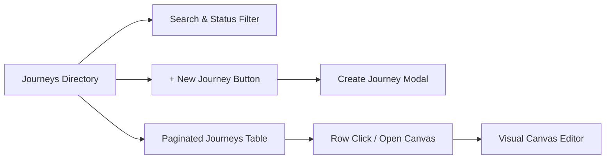
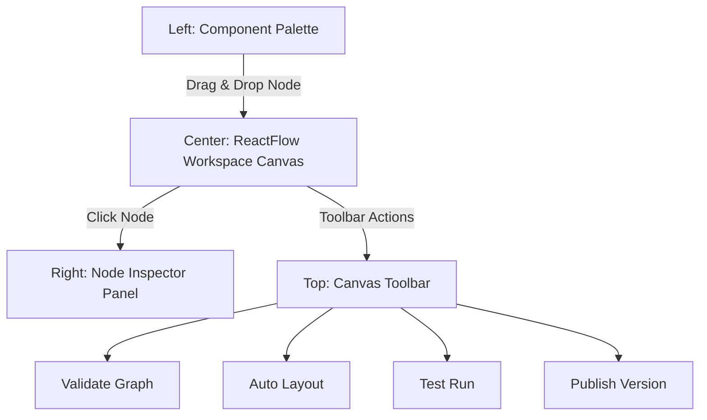
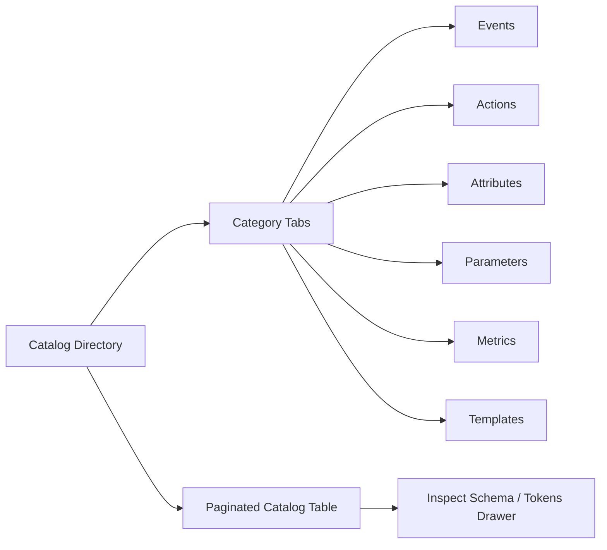
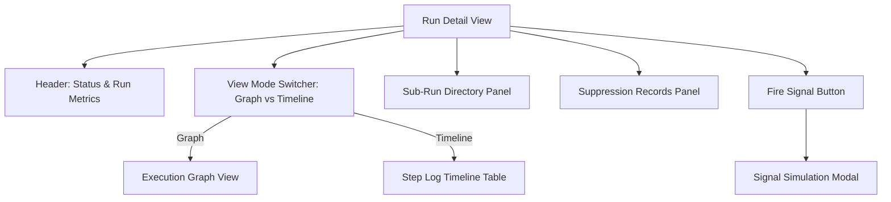

# User Guide: Application Pages & Views

This guide provides detailed documentation for every page and view in the Event-Driven Customer Journey Engine application, detailing user interface elements, controls, tables, buttons, modals, and workflow options.

---

## Page Index

1. [Journeys Management Page (`#journeys`)](#1-journeys-management-page-journeys)
2. [Visual Journey Canvas Editor (`#canvas`)](#2-visual-journey-canvas-editor-canvas)
3. [Catalog Directory Page (`#catalog`)](#3-catalog-directory-page-catalog)
4. [Run History & Execution Monitoring Page (`#runs`)](#4-run-history--execution-monitoring-page-runs)
5. [Run Detail & Execution Trace Inspector (`#run-detail`)](#5-run-detail--execution-trace-inspector-run-detail)
6. [Version History & Canonical IR Diffs Page (`#history`)](#6-version-history--canonical-ir-diffs-page-history)
7. [Static Audience Lists Page (`#static-lists`)](#7-static-audience-lists-page-static-lists)

---

## 1. Journeys Management Page (`#journeys`)

### Purpose
The **Journeys Management Page** serves as the central directory for all journey workflow drafts and published workflows across tenants. Users can view status metrics, search drafts, filter by lifecycle status, create new journeys, or launch the Canvas editor.

### Key UI Elements & Controls
* **Page Header**: Displays the total count of active journey drafts and quick statistics.
* **Search Input**: Text filter matching journey names, descriptions, or draft IDs.
* **Status Filter Dropdown**: Filters the list by lifecycle status:
  * `All`: Shows all workflows.
  * `Draft`: Workflows currently under construction in the Canvas.
  * `Active`: Published workflows executing against live streams.
  * `Paused`: Temporarily halted workflows.
  * `Archived`: Retired workflows retained for historical reference.
* **Paginated Journeys Table**:
  * **Columns**: `Name`, `Status`, `Version`, `Node Count`, `Tenant ID`, `Updated At`, `Actions`.
  * **Status Badges**: Color-coded badges indicating lifecycle stage (e.g., Emerald for Active, Amber for Draft, Purple for Paused, Slate for Archived).
  * **Pagination Controls**: Page numbers, Previous/Next navigation, and rows-per-page selector (5, 10, 20, 50).

### Buttons & Interactive Triggers
* **`+ New Journey` Button**: Primary call-to-action in top right header. Triggers the **Create Journey Modal**.
* **`Open Canvas` Button / Table Row**: Loads the selected draft state into the visual Canvas editor and changes route to `#canvas`.
* **`Delete / Archive` Action Menu**: Triggers a confirmation modal to archive or remove a draft.

### Modals on this Page
* **Create Journey Modal**:
  * **Title**: Create New Journey Draft
  * **Form Fields**:
    * `Journey Name` *(Required)*: Text input for the title of the workflow.
    * `Description` *(Optional)*: Textarea for operational notes or business goals.
    * `Tenant ID` *(Required)*: Dropdown or text field (defaults to `tenant-default`).
  * **Footer Buttons**:
    * `Cancel`: Closes modal without saving.
    * `Create Draft`: Submits the form, provisions a initial graph with a `Start Event` node, and opens the Canvas.

---

## 2. Visual Journey Canvas Editor (`#canvas`)

### Purpose
The **Visual Journey Canvas Editor** is the core interactive environment for designing, configuring, validating, and publishing customer journeys. It features a drag-and-drop node graph, real-time edge connections, property panels, and validation diagnostics.

### Layout Regions
1. **Component Palette (Left Sidebar)**:
   * Categorized list of drag-and-drop workflow nodes.
   * Categories: **Triggers** (Event Start), **Logic & Rules** (Condition, Experiment), **Timing** (Delay, Wait for Event), **Actions** (Email, Push, SMS, In-App, Webhook), **Terminal** (Exit).
2. **ReactFlow Workspace Canvas (Center)**:
   * Pan, zoom, and multi-select canvas interface.
   * Standard node dimensions: **346px width × 112px height**.
   * Interactive input/output handles for connecting nodes via labeled edges.
3. **Node Inspector Panel (Right Sidebar)**:
   * Slide-out panel for configuring selected node properties, parameters, branch conditions, or channel content.
4. **Canvas Toolbar (Floating Top Bar)**:
   * Operational controls for graph validation, formatting, testing, saving, and publishing.
5. **MiniMap & Viewport Controls (Bottom Right)**:
   * Interactive visual overview map, zoom level percentage, fit-to-screen button, and reset viewport button.

### Canvas Toolbar Buttons & Actions
* **`Save Draft`**: Saves the current graph node array and edge connections to local state and engine backend.
* **`Auto Layout`**: Automatically recalculates positions using an acyclic directed graph layout algorithm to arrange nodes into neat columns and rows.
* **`Validate Graph`**: Runs real-time diagnostic checks across all canvas nodes. Displays warning/error counters on toolbar and highlights invalid nodes with warning borders.
* **`Test Run`**: Opens the **Test Run Modal** to simulate execution of the draft workflow.
* **`Publish`**: Validates structural compliance and compiles the graph into a published Canonical IR version.
* **`Context / Agent Info`**: Opens the **Agy Context Modal** displaying workspace metadata.
* **`Shortcuts` (`?` key)**: Opens the **Keyboard Shortcuts Modal**.

### Modals in the Canvas Editor
* **Parameter Modal**: Key-value pair modal for editing custom parameters and dynamic tokens.
* **Conflict Dialog**: Appears when concurrent edit conflicts occur (ETag mismatch). Options: `Keep Local Version` or `Reload Remote Version`.
* **Agy Context Modal**: Displays agent execution context, schema version, and graph metadata.
* **Keyboard Shortcuts Modal**: Displays full list of hotkeys (Cmd+Z for Undo, Cmd+Shift+Z for Redo, Delete for remove node, Esc for deselect).

---

## 3. Catalog Directory Page (`#catalog`)

### Purpose
The **Catalog Directory Page** manages reusable assets, definitions, schemas, and content templates used across journeys.

### Key Category Tabs
1. **Events**: Catalog of trigger event definitions (e.g., `cart_abandoned`, `user_registered`, `order_completed`) with JSON schema specs.
2. **Actions**: Pre-configured channel action definitions (Email, Push, SMS, In-App, Webhook).
3. **Attributes**: Customer profile attributes available for condition evaluations (e.g., `subject.first_name`, `subject.tier`).
4. **Parameters**: Global key-value environment variables accessible in template tokens.
5. **Metrics**: Conversion metrics and goal tracking definitions for Experiment nodes.
6. **Templates**: Pre-written multi-channel message templates with token preview support.

### Controls & Actions
* **Category Tab Bar**: Switches catalog views.
* **Search Input**: Filters catalog entries by key name, display label, or tag.
* **Token Preview Drawer**: Clicking a template displays dynamic token replacement placeholders (e.g., `{{subject.first_name}}`, `{{event.data.cart_value}}`).
* **`Create Catalog Entity` Button**: Opens creation modal to register new event schemas or action definitions.

---

## 4. Run History & Execution Monitoring Page (`#runs`)

### Purpose
The **Run History Page** provides operational monitoring across all journey execution instances. Operators can track real-time statuses, investigate failures, filter by mode, and drill down into trace logs.

### Key UI Elements & Filters
* **Execution Mode Selector**: Toggle between execution lanes:
  * `All Modes`: Displays both production and test runs.
  * `Production`: Shows live customer journey execution instances.
  * `Test`: Shows test executions triggered via test runs or static audience lists.
* **Status Filter Dropdown**:
  * `All Statuses`: Displays all execution states.
  * `Running`: Active workflows currently processing steps or waiting for events/delays.
  * `Completed`: Workflows that successfully reached an Exit node.
  * `Failed`: Workflows that encountered unhandled errors or activity failures.
  * `Paused`: Halting workflows waiting for manual intervention.
* **Date Range Picker**: Filter runs by start date and end date boundaries.
* **Search Input**: Filter by `Run ID`, `Workflow ID`, or `Tenant ID`.
* **Paginated Runs Table**:
  * **Columns**: `Run ID`, `Workflow Name`, `Status`, `Execution Mode`, `Started At`, `Duration`, `Actions`.
  * **Badges**: Distinct badges for execution modes (e.g., Blue for Production, Amber for Test) and statuses.

### Actions
* **Row Click / `View Trace` Button**: Navigates to the **Run Detail Page** (`#run-detail?runId=<id>`) to inspect execution step graphs.

---

## 5. Run Detail & Execution Trace Inspector (`#run-detail`)

### Purpose
The **Run Detail Page** provides deep observability into a specific journey execution instance, displaying interactive step-by-step visual execution graphs, timeline logs, sub-run breakdowns, and signal simulation triggers.

### Key Views & Sub-Panels
1. **Header & Summary Stats**: Displays active Run ID, Tenant ID, current execution status, elapsed duration, and trigger event payload.
2. **View Mode Switcher**:
   * **Graph View**: Visual representation of the journey graph highlighting completed node visit steps with status color indicators (Green for completed, Amber for active/waiting, Red for failed).
   * **Timeline View**: Chronological table of node visits, activity start/end timestamps, step input parameters, and output results.
3. **Sub-Run Directory Panel**: Lists nested or spawned child sub-runs with navigation links to inspect child workflow traces.
4. **Suppression Records Panel**: Details any communication messages suppressed by rate limits, frequency caps, or customer opt-out rules.

### Buttons & Interactive Controls
* **`Fire Signal` Button**: Triggers the **Signal Simulation Modal** to emit external event signals directly into a running workflow instance.
* **`Back to Runs List` Button**: Returns to the Run History table view.
* **Sub-Run Selector**: Click any sub-run ID to switch the execution graph trace to that child process.

### Modals on this Page
* **Signal Simulation Modal**:
  * Allows operators to manually trigger incoming event signals (e.g., `user_purchased`, `cart_updated`) or send cancellation signals to active `Wait for Event` or `Delay` nodes.

---

## 6. Version History & Canonical IR Diffs Page (`#history`)

### Purpose
The **Version History Page** provides an immutable audit trail of published journey workflow revisions, allowing teams to inspect hash checksums, review version diffs, and audit graph structural changes.

### Key UI Elements & Controls
* **Journey Draft Selector**: Dropdown to select which journey workflow to inspect.
* **Version Comparison Selectors**:
  * `Version 1 (V1)`: Baseline version dropdown.
  * `Version 2 (V2)`: Comparison version dropdown.
* **Revision Audit Table**:
  * Displays version number, author/operator, publish timestamp, node count, edge count, and immutable SHA-256 hash checksum.
* **Canonical IR Diff Viewer**:
  * Highlights structural graph additions, deletions, modified node configurations, parameter changes, and edge routing adjustments between V1 and V2.

### Actions
* **`Inspect IR Schema`**: Displays raw JSON graph schema definition.
* **`Revert / Restore Version`**: Provisions a new draft version copied from the selected historical revision.

---

## 7. Static Audience Lists Page (`#static-lists`)

### Purpose
The **Static Audience Lists Page** manages CSV audience files and static customer cohorts used for testing journey behavior, running validation passes, or conducting batch communications.

### Key Metrics Bar
* **Total Lists**: Count of static lists uploaded across the tenant.
* **Total Items Count**: Total customer records contained across all lists.
* **PII Classification Count**: Count of lists flagged as containing Personally Identifiable Information (PII).

### Controls & Table Features
* **Search Bar**: Search by list name, list ID, or description.
* **Data Classification Filter**: Filter lists by data privacy level (`All`, `PII`, `Standard / Anonymized`).
* **Paginated Lists Table**:
  * **Columns**: `List ID`, `Name`, `Item Count`, `Classification`, `Uploaded At`, `Actions`.
  * **Inspect Button**: Opens record preview drawer to view sample customer profile fields.

### Modals on this Page
* **Static List Upload Modal**:
  * **Drag-and-Drop Dropzone**: Upload CSV customer list files.
  * **Field Mapping Selector**: Map CSV header columns to subject fields (`subject_id`, `email`, `first_name`, `tier`).
  * **Classification Flag**: Toggle `PII` classification status.
  * **Submit Button**: Parses CSV data, validates record format, and creates the static audience list.
